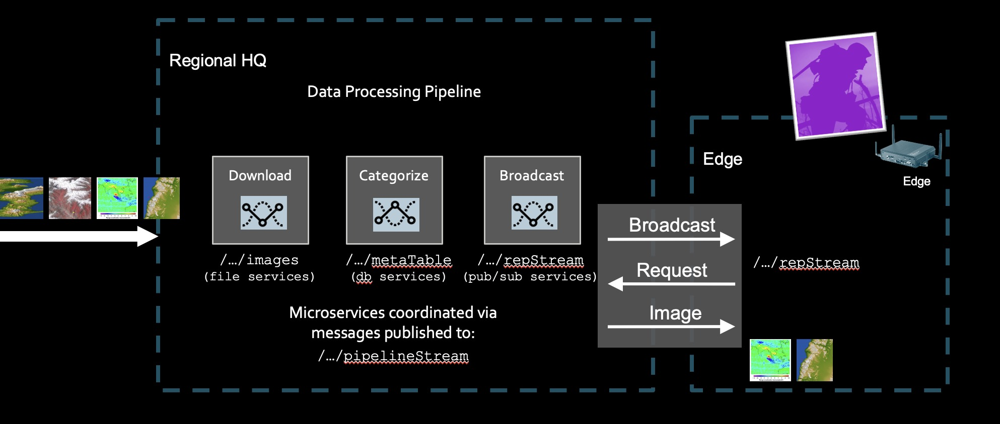

# MissionX — an edge-to-core data pipeline for partially connected teams

When a field team is on an intermittent link, the expensive mistake is replicating
everything to them by default. **MissionX** demonstrates the opposite arrangement across
two [HPE Data Fabric](https://www.hpe.com/us/en/hpe-ezmeral-data-fabric.html) clusters:
headquarters continuously broadcasts small *descriptions* of new assets to every field
site, and bulk data crosses the link only when a team explicitly asks for it — and only
when they choose to spend the bandwidth. Messages flow both ways over a single
bidirectional replicated stream, so the field site needs no direct access to HQ storage.
It is a reference for anyone designing systems for disconnected or bandwidth-constrained
operations, where deciding *what* crosses the link matters more than how fast it goes.



> **Looking for the newer version?** [**satellite**](https://github.com/erdincka/satellite)
> develops this same edge-and-core pattern further: it adds a vision model at the edge,
> and it runs entirely in one container on a laptop rather than needing a cluster to try.
> Start there unless you specifically want the two-cluster arrangement shown here.

## The flow

### At headquarters

| Service | What it does |
|---|---|
| **Image Feed** | Every few seconds, publishes metadata for a few assets onto the pipeline stream — a description and a download link, not the data |
| **Image Download** | Picks those up, downloads the actual file, stores it in a Data Fabric volume, and marks the asset ready |
| **Asset Broadcast** | Publishes ready assets onto the *replicated* stream, so every field site sees them |
| **Asset Response** | Listens on `ASSET_REQUEST`; when a team asks for something, copies the file into a mirrored volume |

### At the edge

The field team first confirms upstream communication — that the replicated stream is
receiving messages and the volume can mirror. **Broadcast Listener** then populates a
table with everything HQ has announced. Marking a row as wanted makes **Asset Request**
publish to `ASSET_REQUEST`, and the row shows as *Requested*.

HQ responds by copying the file into the mirrored volume. The team then starts
**Asset Viewer** and re-initiates the mirror to pull the data down. That last step stays
manual by design: the field team decides when to use their link.

Because Data Fabric streams are multi-master, one replicated stream carries
`ASSET_BROADCAST` outwards from HQ and `ASSET_REQUEST` back from the field. Expect a
minute or two end to end — replication is asynchronous, and the app adds deliberate
delays so the flow is watchable.

The sample assets are drawn from a real 2014 public imagery feed.

## Prerequisites

Two Data Fabric clusters with **cross-cluster global namespace** enabled — see
[XCLUSTER.md](./XCLUSTER.md), and the vendor guide for
[configuring gateways for table and stream replication](https://docs.ezmeral.hpe.com/datafabric-customer-managed/78/Gateways/ConfiguringMapRGatewaysForTRAndI.html).

Required on the core cluster:

```bash
mapr-kafka
mapr-nfs4server           # global namespace over external NFS needs nfs4server, not mapr-nfs
mapr-data-access-gateway  # REST API access
mapr-gateway              # stream replication
```

Enable cluster and data auditing to see replication status. A user with volume, table
and stream creation rights is enough; on an isolated demo cluster the admin (`mapr`)
user is simplest, and the setup step will configure auditing for you.

## Running it

### With Docker

```bash
docker compose up -d
```

Set `MAPR_IP` and `EDGE_IP` in `docker-compose.yaml` to your two clusters first. The
interface is then at <http://localhost:3000>.

### On Kubernetes

Import [`helm-package/demoapp-0.0.6.tgz`](./helm-package/demoapp-0.0.6.tgz) with
[`helm-package/logoX.png`](./helm-package/logoX.png) as the logo. On HPE Private Cloud
AI this is the **Import Framework** wizard; see the
[vendor instructions](https://docs.ezmeral.hpe.com/unified-analytics/15/ManageClusters/importing-applications.html).
Change the release name from `demo` to `missionx`, and set the endpoint hostname to
match, in `values.yaml` during import.

### First run

Use the **disconnected link** icon to run initial setup. It asks for the host running
the Data Access Gateway, then creates the `/apps/missionX` and `/apps/missionX/files`
volumes and the streams the demo needs.

## Notes

- Click a running service's name in the left-hand list to stop it. Useful when there
  are too many tiles to follow — and services do occasionally fail silently without the
  UI noticing, in which case stop and restart them.
- The switch at the top right enables debug logging.

## Built with

Python 3.12 and [NiceGUI](https://nicegui.io), talking to Data Fabric over its REST API,
OJAI tables and streams.
